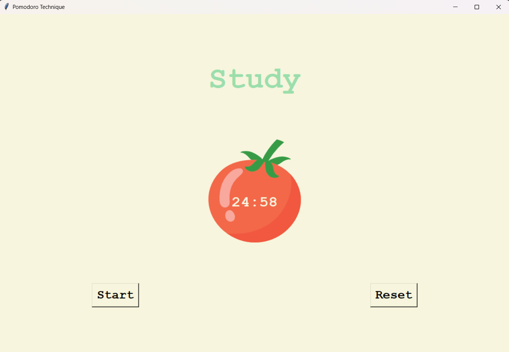
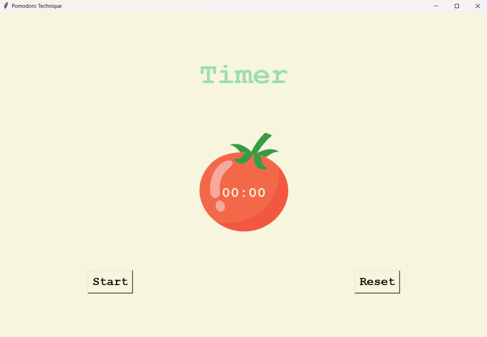

# ⏳ Pomodoro Timer (Tkinter)

A simple **Pomodoro Timer** built using Python's Tkinter library. This application helps you manage your work and break intervals using the popular **Pomodoro Technique**.

## 🚀 Features

- 25-minute work sessions
- 5-minute short breaks
- 20-minute long breaks after every 4 work sessions
- Automatic session switching
- Visual indicators of progress (✅)
- Reset functionality

## 🖼️ Screenshots

### 👨‍💻 Study Session


### ⏹️ Timer Reset


## 🛠️ How to Run

1. Clone this repository:
   ```bash
   git clone https://github.com/yourusername/pomodoro-timer.git
   cd pomodoro-timer
2. Make sure you have Python installed (version 3.x recommended).

3. Run the application:
   python main.py

📁 File Structure
pomodoro-timer/

│
├── main.py             # Main application script

├── tomato.png          # Pomodoro (tomato) image

├── screenshot1.png     # Study session screenshot

├── screenshot2.png     # Reset timer screenshot

└── README.md           # This file

📚 Pomodoro Technique
The Pomodoro Technique is a time management method developed by Francesco Cirillo. It uses a timer to break work into intervals, traditionally 25 minutes in length, separated by short breaks.

Work with the time you have, not against it.
